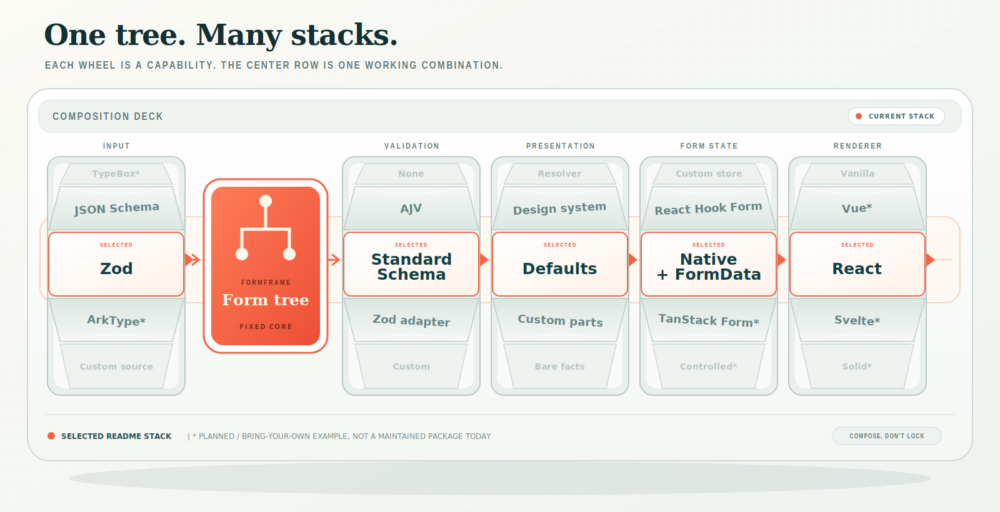

# FormFrame

Automatic forms from schemas without losing control.

FormFrame compiles the schema that already describes your data into a common
form tree, then renders sensible default fields from that tree. Keep the
generated form where it works; replace a node, layout, or field part where your
product needs something specific.

Zod and JSON Schema input packages ship today. Other schema languages and
application-specific models can target the same public tree without requiring a
different renderer.

## Quick start

In an existing React and TypeScript app:

```bash
npm install @formframe/core @formframe/input-zod \
  @formframe/renderer-react zod
```

```tsx
import { z } from 'zod'
import { zodToTree } from '@formframe/input-zod'
import { useFormTree } from '@formframe/renderer-react'

const profileSchema = z.object({
  name: z.string().min(1).meta({ title: 'Name' }),
  email: z.string().email().meta({ title: 'Email' }),
  role: z
    .enum(['Developer', 'Designer', 'Product manager'])
    .meta({ title: 'Role' }),
  updates: z.boolean().optional().meta({ title: 'Send me product updates' }),
})

const profileTree = zodToTree(profileSchema)

export function ProfileForm() {
  const { SchemaFields, submit } = useFormTree(profileTree)

  return (
    <form onSubmit={submit((data) => console.log(data))}>
      <SchemaFields />
      <button type="submit">Save profile</button>
    </form>
  )
}
```

`SchemaFields` renders the form content. You keep ownership of the `<form>`,
buttons, loading state, navigation, and success flow. The default path uses
native uncontrolled controls and assembles nested submission data from
`FormData`.

## Add schema validation

Form generation and validation are separate capabilities. `zodToTree` reads the
schema's structure; Standard Schema validates submitted values. Standard Schema
does **not** expose enough structural information to generate fields.

Adapt any synchronous Standard Schema implementation with
`fromStandardSchema`. For the Zod schema above:

```tsx
import { fromStandardSchema } from '@formframe/core'
import {
  useFormTree,
  ValidationProvider,
  ValidationSummary,
} from '@formframe/renderer-react'

const validator = fromStandardSchema(profileSchema)

export function ProfileForm() {
  const { SchemaFields, submit, validation } = useFormTree(profileTree, {
    validator,
  })

  return (
    <form noValidate onSubmit={submit((data) => console.log(data))}>
      <ValidationProvider {...validation}>
        <ValidationSummary />
        <SchemaFields />
      </ValidationProvider>
      <button type="submit">Save profile</button>
    </form>
  )
}
```

Validation runs on submit here. Wire the returned `revalidate` handler to
`onInput`, `onChange`, or `onBlur` when the product calls for live validation.
Successful transformed output is passed to the submit callback. The neutral
validator contract is currently synchronous; async Standard Schema validation
is not yet supported.

## Customize one generated part

Every default is also a re-entry point. This adds context to the generated email
label while preserving its default control, description, errors, and the rest
of the form:

```tsx
<SchemaFields
  renderNode={(node, { Default }) =>
    node.isField && node.path === 'email' ? (
      <Default
        of={node}
        parts={{
          label: (label) => (
            <span>
              <Default of={label} />
              <small> Account notifications only.</small>
            </span>
          ),
        }}
      />
    ) : (
      <Default of={node} />
    )
  }
/>
```

The fallback `<Default of={node} />` renders a whole node normally. To own a
group's layout while preserving its generated descendants, re-enter through
`Children`:

```tsx
renderNode={(node, { Default, Children }) =>
  node.isGroup && node.path === 'address' ? (
    <section className="address-grid">
      <Children of={node} />
    </section>
  ) : (
    <Default of={node} />
  )
}
```

`Default` and `Children` are also exported from
`@formframe/renderer-react` for authored layouts outside `renderNode`.

## Choose a schema input

Input compilers are peers: each translates one source into the same FormFrame
tree. A source's ability to validate through Standard Schema does not make it a
structural form input.

| Source | Form generation | Validation |
|---|---|---|
| Zod v4 | `zodToTree` from the maintained `@formframe/input-zod` package | `fromStandardSchema`, or `createZodValidator` for richer Zod issue metadata |
| JSON Schema draft-07 | `jsonSchemaToTree` from the maintained `@formframe/input-jsonschema` package | `createAjvValidator` from `@formframe/validation-ajv` |
| ArkType | No maintained input package yet; an ArkType compiler can target Core's public tree builders | `fromStandardSchema` |
| Your own source | Write a small compiler against Core's public builders | Supply any FormFrame `Validator` |

Switching the quick start to JSON Schema changes the compiler, not the React
binding:

```tsx
import { jsonSchemaToTree } from '@formframe/input-jsonschema'

const profileTree = jsonSchemaToTree({
  type: 'object',
  properties: {
    name: { type: 'string', title: 'Name' },
    email: { type: 'string', format: 'email', title: 'Email' },
  },
  required: ['name', 'email'],
})
```

See the evidence-backed support catalogs for exact current behavior:

- [Zod support](./packages/input-zod/SUPPORT_CATALOG.md)
- [JSON Schema support](./packages/input-jsonschema/SUPPORT_CATALOG.md)

## How it composes



The highlighted row is the stack used by the complete React example, not the
only supported composition. Asterisks mark planned or bring-your-own examples,
not maintained packages available today.

Core is the neutral boundary: it imports no schema language, framework,
validator, form-state library, or DOM API. Compilation, validation,
presentation, rendering, and form state remain independently composable. Most
React users can stay on the `zodToTree` or `jsonSchemaToTree` plus `useFormTree`
path and only use the lower interfaces when they need a new adapter.

## Clear ownership boundaries

FormFrame owns the reusable form mechanics:

- a schema-neutral tree that input packages compile into;
- sensible default controls and semantic field structure;
- nested objects, repeatable arrays, choices, and `FormData` assembly;
- recursive node, subtree, and part customization;
- presentation, renderer, and validator contracts that applications can
  replace independently.

Your application keeps the product decisions:

- the `<form>` element, buttons, and submit lifecycle;
- loading, saving, cancellation, success, and navigation;
- layout, copy, styling, and design-system components;
- when validation runs and when errors become visible;
- whether a form needs reactive state at all.

There is deliberately no library-owned page shell or kitchen-sink form
component. Generated fields remain content inside ordinary application code.

## Native by default, reactive when needed

The reference path uses native uncontrolled controls and `FormData`: no
form-state dependency, no value-driven React rerender on every keystroke, and
enough behavior for static and submit-time forms.

Reach for a reactive form-state adapter when a form needs live dependencies,
controlled values, dirty-state orchestration, or interop with an existing form
platform. React Hook Form and similar integrations are reference recipes to
copy and adapt, not a growing matrix of maintained wrapper packages. Validation
adapters remain packages because their contracts are reusable without
application-specific UI and state choices.

The same rule applies to customization data. React makes code-first exceptions
easy through JSX. When the customization itself must be stored in a database,
put that serializable policy in a source-specific or application adapter rather
than expanding Core into another UI schema. **Serialize when you must; code when
you can.**

## When FormFrame fits

FormFrame is a good fit when schemas are real application data:

- forms come from APIs, databases, configuration, or shared domain models;
- most fields should be generated, while a few need product-specific UX;
- several forms should share one presentation and validation approach;
- layout belongs in application code rather than a second schema.

If every field is static and hand-designed, or the primary need is a
controlled-value state manager, a regular form library will usually be simpler.

## Main packages

| Package | Purpose |
|---|---|
| `@formframe/core` | Schema-neutral form tree, presentation, submission, validation contract, and Standard Schema interop |
| `@formframe/input-zod` | Zod v4 input compiler |
| `@formframe/input-jsonschema` | JSON Schema draft-07 input compiler |
| `@formframe/renderer-react` | React hook, default renderer, continuation customization, and error display |
| `@formframe/renderer-vanilla` | DOM and string renderer |
| `@formframe/validation-ajv` | AJV-backed JSON Schema validator |
| `@formframe/validation-zod` | Zod validator with source-specific issue metadata |

FormFrame is under active pre-v1 development; public APIs may still change.

## Design principles

- A schema generates the ordinary form; code handles the exceptions.
- No schema language, renderer, validator, or form-state library is privileged
  by Core.
- Every default provides a way back into the engine.
- Capabilities are injected explicitly; FormFrame does not guess behavior from
  a node's origin.
- Core stays stateless and stubborn. User-written adapters extend it rather than
  forking it.
- New seams are earned by real implementations, not designed speculatively.

## Learn more

- [Example app](./examples/basic-react)
- [Architecture](./ARCHITECTURE.md)
- [Project glossary](./CONTEXT.md)
- [Architecture decisions](./architecture_records)
- [Contributor and agent workflow](./AGENTS.md)

## License

MIT
